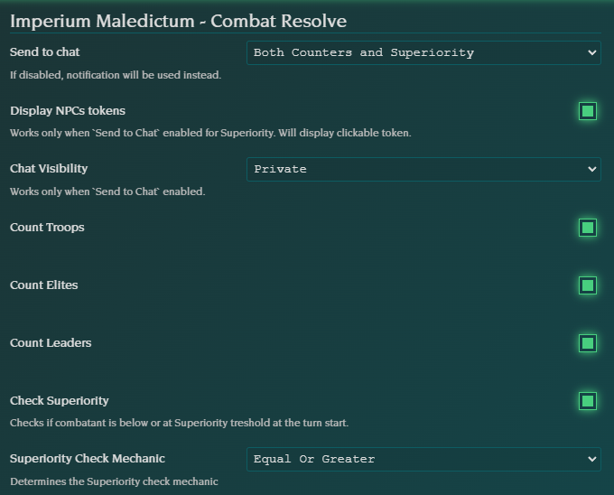

# Imperium Maledictum - Combat Resolver


[](https://ko-fi.com/B0B0V5J9L)

FoundryVTT module for the Imperium Maledictum system which handles Resolve in combat and helps tracking defeated enemies each round.

## Installation

### FoundryVTT

The package is available through the [module registry](https://foundryvtt.com/packages/impmal-combat-resolve) or installing from manifest URL directly using [latest module.json](https://github.com/Kayne/impmal-combat-resolve/releases/latest/download/module.json).

### Manually

The package can be [downloaded as module.zip](https://github.com/Kayne/impmal-combat-resolve/releases/latest/download/module.zip) and just copy to your installation's module folder.

### Git

Clone this repository into your installation's module folder:
```
git clone https://github.com/Kayne/impmal-combat-resolve.git
```

## Features

### Count defeated enemies

After each round, module counts how many Troops, Elites and Leaders were defeated last round and sends summary to chat or as notification. Why? To remember to increase Superiority, of course! (p. 197 Imperium Maledictum Core Book)

### Lists Troop NPCs which are below Superiority treshold

Lists clickable tokens in chat message which belongs to Troop NPC whose Resolve is equal to or below the Superiority (p. 197 Imperium Maledictum Core Book). 

## Examples

Chat Message listing defeated enemies and lists Troop NPC with Resolve below Superiority treshold.


Instead of Chat Message, notification is also an option.


Settings can be adjusted to just count specific NPCs type, and more.



## Licensing
This project is being developed under the terms of the [LIMITED LICENSE AGREEMENT FOR MODULE DEVELOPMENT](https://foundryvtt.com/article/license/) for Foundry Virtual Tabletop.

This project is licensed under [MIT License](https://raw.githubusercontent.com/Kayne/impmal-combat-resolve/main/LICENSE).

## Contact

The best place to track bugs is to create a [new issue](https://github.com/kayne/impmal-combat-resolve/issues/new).

For other questions, I am on both the Moohammer and the FoundryVTT Discord servers as @kayne1942.

## Acknowledgements

Big thanks to [Moo Man](https://github.com/moo-man) for developing great Warhammer 40k and Fantasy systems and modules for FVTT.
Also for Atropos and whole FVTT development team for providing great tool. Without [Foundry VTT](https://foundryvtt.com) my RPG life would be much poorer.
